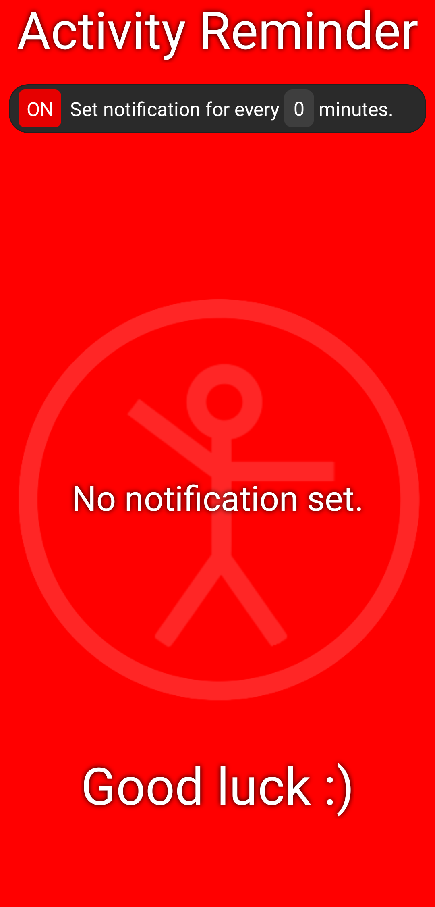
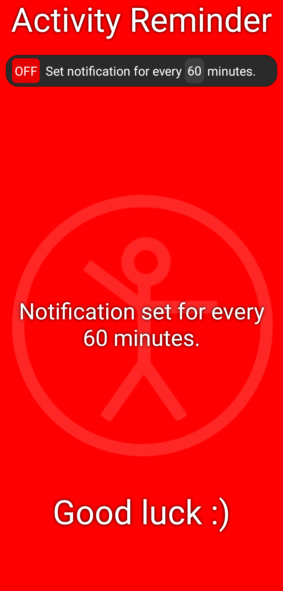

# Activity Reminder

Activity Reminder is an app that reminds you to take a break from sitting and do an activity like stretching, jumping jacks, push-ups or any activity of your choosing.

<table>
  <tr>
    <td align="center">
      
    </td>
    <td align="center">
      
    </td>
   </tr>
</table>

## Installation

To install the app, download the correct .apk file for your device from the latest [Release](https://github.com/jaketzu/ActivityReminder/releases), and run it on the device. If you're unsure which file to download for your system, you can download the ActivityReminder-v-.-.--universal.apk file, which takes more space but should work on each Android device above Android version 10.

You can clone the repository and run the app with `npm start`. If you don't have React Native set up on your device you can use [this guide](https://reactnative.dev/docs/environment-setup?guide=native).

### Usage

To get started, input the amount of minutes you want the time between reminders to be and press the red 'ON' button. Once the time has passed, you will get a notification reminding you to take a break!

## Limitations

-   The time between notifications might be off by a couple minutes. I haven't found a reason for this yet, but I'm guessing it's due to the notification package not being meant for use with such short intervals.
-   Due to restrictions with the notification package, the interval must be set to at least 15 minutes.
-   I haven't been able to test the iOS version due to not owning macOS or iOS devices. Needless to say, I can't be sure it works. You're welcome to check for me!

## Made with

Using the [Notifee](https://github.com/invertase/notifee) library and [AsyncStorage](https://github.com/react-native-async-storage/async-storage) package.

## Created by

**Jaakko Nevala**

